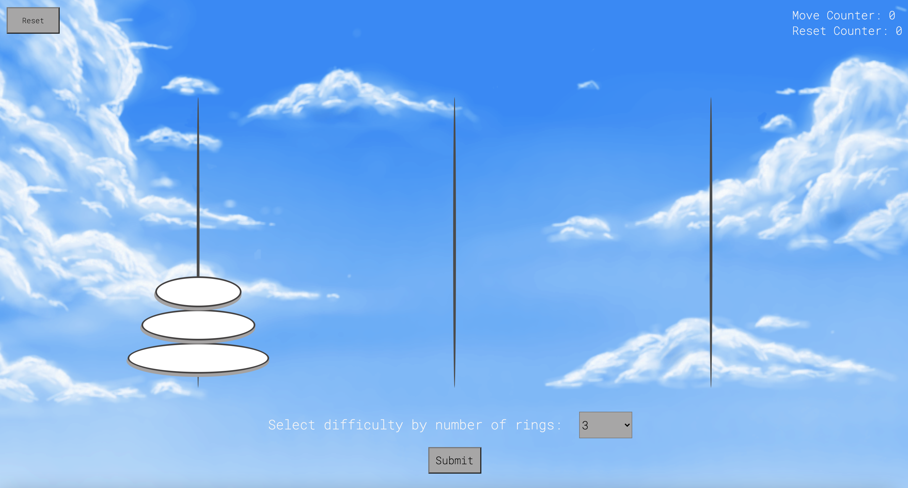
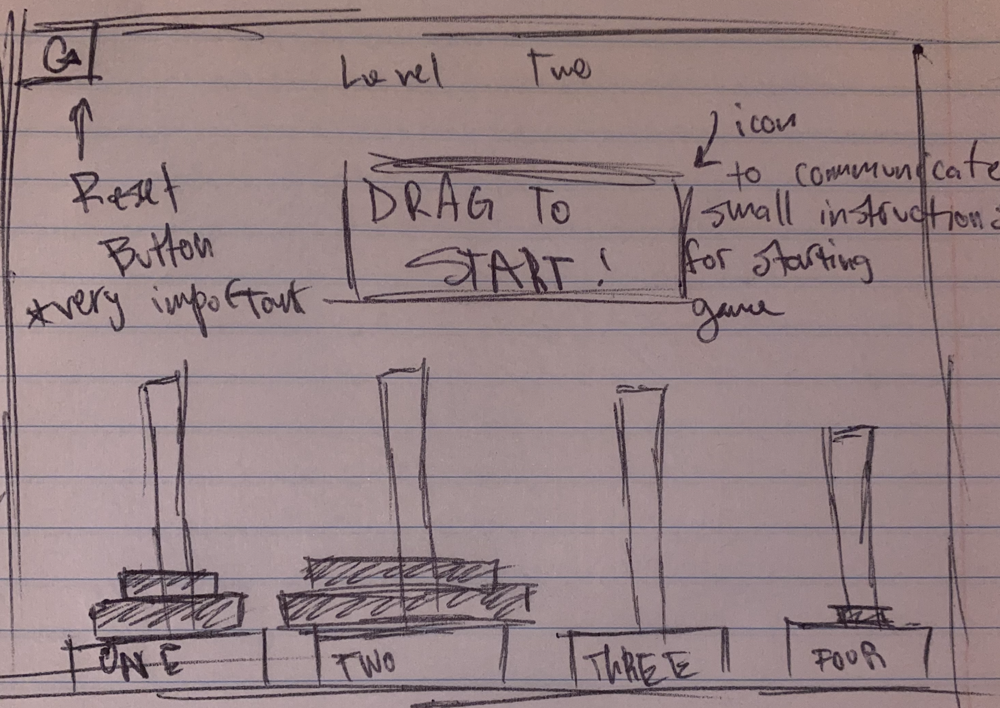

# Towers_of_Hanoi

##### Towers of hanoi game built with:
- Css
- Html 
- Javascript 

#### Play the game: 
https://westonperkins.github.io/Towers_of_Hanoi/
###### **Enable your browers camera for the full effect*

---

### How to play Towers of Hanoi
Simply put, the goal is to get the rings, however many there may be, from the starting position (tower) to the end position (tower) in the same order that the rings were origionally placed in. There are typically three towers, a starting tower, a central tower to help distribute movements, and an end tower. In my edition there is no explicit "end" tower, either two of the origionally empty towers can act as an "end" or a central". Upon moving the rings, you will see they descend in width from top to bottom. `You cannot place a ring of greater width on top of a ring with smaller width when trying to move, if a movement is made, the ring being placed must be smaller than the ring underneath it or the tower must be empty on placement. The only rings that can be moved are the highest rings on any given tower, if the ring is not at the highest point on the tower it cannot be moved.` Once the rings are succesfully placed from the starting tower for an alternative tower in the same starting order (from smallest to largest), the game has been won. 

 

##### Key
- Top right displays the amount of moves you've made during a given level/turn as well as the amount of times you've had to reset the playing field during the game level.
- Underneath the towers displays a drop down menu where you can choose between 3 - 8 rings. After you successfully beat a given set of rings, the following number of rings will be automatically suggested to you, if you wish to play on just hit `submit` as the new number will be rendered automatically within the dropdown
-  The top left offers a `reset` button where you are able to reset the field if you get stuck. Pressing the button does not count as a move however it does not reset the counter, and it will add 1 to the reset counter (obviously)

---
#### Wireframes

Very basic layout of the game. First drawing to illustrate general themes and game landscape.

---

### MVP
The game needs to be playable at its core. Meaning:
- The user needs to be able to move pieces from one pillar to another and with appropriate order. 
- The user needs to be able to lose and win and definitely reset if they get stuck. Because the game is capable of producing a 'dead end' scenario without winning, you need to be able to reset. This would technically be characterized as losing since the chance of winning after this result is met is impossible. 
- Overall, the user must be able to move the rings from one pillar to the other, the game also must recognize what is a valid or invalid maneuver. 
- The game must recognize a win and give the player the option of resetting the field if there is no valid move to make.

---

### User Stories
Users are anyone who might find the game interesting &/or stimulating the users will want to be able to play the game but more so to be challenged. Because it has the agility to be a fairly simple game, it must at least progress in difficulty , whether that's a quick progression or a very long one. Without assuming the user knows how to play the game the user might want some sort of visual walkthrough on load, some sort of instructions that will be simpler and easier to digest than the ReadMe. Either way the user wants the game to be challenging but also easy to play from a GUI perspective. This means the interface cant be clunky and hard to use, it must be intuitive and smooth.

--- 
### Strech Goals

##### Origional 'Stretch Goals' before starting build
- animations for movement / loading screen / intro sequence / visual instruction manual
- drag and drop from pillar to pillar
- array key integration
- potentially a seconds counter for a user to execute a win - to try and beat a previous game time
- multiple levels of increasing difficulty
- animations for win
- sound integration
- reset animations
- a really nice looking GUI
- API integration (dont know for what yet but definitely can think of something

##### 'Stretch Goals' after completion
*** I felt like my origional stretch goals were mainly just flashy and didn't have anything to do with the game itself, they were just general additives that would make the GUI look more compelling, but if i were to add more they would have to do with Towers of Hanoi specifically as a puzzle and how to make it more enjoyable or competetive 
   - Able to create a 'computer solve' button where if clicked the computer solves the puzzle with the minimum amount of moves.
        - Currently the user has no idea whether or not they are winning with max efficiency or not. I feel like a win is cool but I would like to write a sorting algorithm that calculates minimum amount of moves for X amount of rings with Y amount of pillars, for my game there will always bve 3 pillars though.
-  I wouild have loved to create a backend server that keeps a record of the player and how many moves and resets it took them to solve a level with X amount of rings.
- In terms of gerernal game expirience I would have liked to add arrow key functionality which was on my origional list but I never got to it. I feel like it would be a little more enjoyable than having to click every ring, after building it it got quite tedious. 